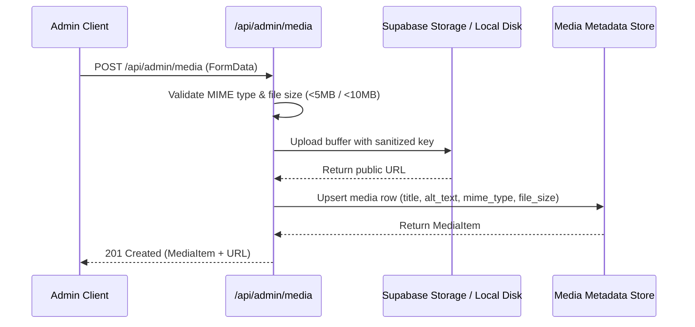
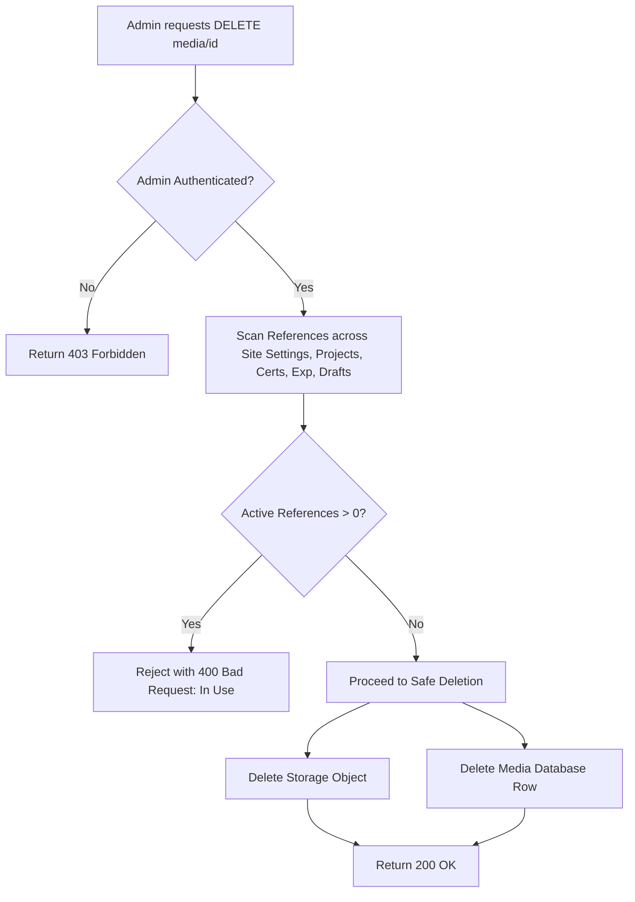

# Portfolio Media Architecture & Storage Specification

This document details the storage architecture, data models, file access policies, and integration points for all media assets in the Machine Learning Engineer portfolio.

---

## 1. Architectural Principles

1. **Storage Decoupled from Content Records**:
   - Binary media files (images, PDF documents) are stored in dedicated cloud storage buckets (`portfolio-images`, `portfolio-documents`) or local persistent disk (`/uploads`).
   - Content tables (`projects`, `certifications`, `experience`, `site_settings`, `sections`) store only URI references and keys, never raw binary blobs.
2. **Central Source of Truth**:
   - The `public.media` table serves as the metadata authority for all assets.
   - Every file upload registers a corresponding row containing MIME type, file size, dimensions, title, alt text, and storage key.
3. **Reference Integrity**:
   - Content entities own which media they reference.
   - The media system monitors usage to prevent orphaned file references or accidental deletion of assets that are actively displayed on the public site.

---

## 2. Storage Organization

```
Storage Root
├── portfolio-images/
│   ├── [timestamp]-[safe-file-name].jpg
│   ├── [timestamp]-[safe-file-name].png
│   └── [timestamp]-[safe-file-name].webp
└── portfolio-documents/
    └── [timestamp]-[safe-file-name].pdf
```

### Supported MIME Types & Constraints

| Category | Supported MIME Types | Max Size | Target Storage Bucket |
| :--- | :--- | :--- | :--- |
| **Images** | `image/jpeg`, `image/png`, `image/webp`, `image/gif`, `image/svg+xml` | **5 MB** | `portfolio-images` |
| **Documents** | `application/pdf` | **10 MB** | `portfolio-documents` |

---

## 3. Upload & Registration Flow



---

## 4. Deletion Protection Architecture



---

## 5. Security & Access Control

- **Admin Operations**: Read, Upload, Update Metadata, and Delete Unused Media are restricted to authenticated administrator sessions via `AuthServerService.isAdmin()`.
- **Public Portfolio Access**: Unauthenticated visitors can only download or display media assets that are referenced by active, published content.
- **Draft Isolation**: Media uploaded for draft-only content remains hidden from the public portfolio until the draft is explicitly published.
